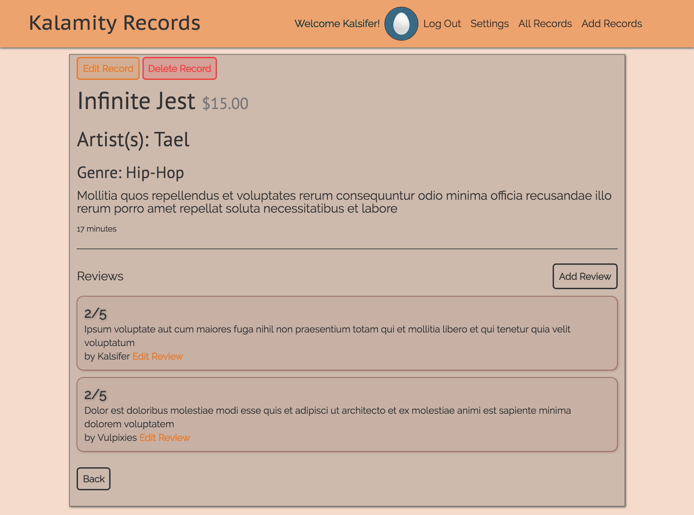

# Flickr Clone
### Record store website for fictional business
### Steven Galvin, July 7th, 2017

This is a website for the fictional store Kalamity Records. I made this using Ruby on Rails with the help of devise for user authentication and authorization. It has two user accounts, basic and admin. Admin accounts can add records, update records, and delete records, as well as delete any reviews on those records. User accounts can add their own reviews to records, edit their reviews, and delete their reviews. All users will be able to view the stores collection of records. Testing will be covered with SimpleCov to make sure at least 90% of my site has been succesfully tested.

The website has three basic account already set up if installation instructions are followed accordingly.

Admin Account:
  * email: admin@admin.com
  * password: asdfas

User1:
  * email: user1@user1.com
  * password: asdfas

User2:
  * email: user2@user2.com
  * password: asdfas

## Landing Page:

## Planning

### 1. Configuration/dependencies
  The app will primarily use Ruby on Rails and the SQL database. User authentication is made with the Devise gem. It was made with what I learned from week 2 of Epicodus' Rails course. Styled with bootstrap and SASS.

  Future plans include:
  * Add pictures with paperclip
  * Hosting the site live
  * Updating the style of the page

### 2. User Stories
  * As a user, I'd like to create an account
  * As a user, I'd like to be able to view all records
  * As a user, I'd like to be able to visit records detail page and leave reviews
  * As a user, I'd like CRUD functionality over reviews I've added
  * As an admin, I'd like CRUD functionality over records in the store
  * As an admin, I'd like to be able to delete user reviews I deem inappropriate

### 3. Integration
  * Root component/Index page with signup or signin fields
  * Page to display all records
  * Dynamic record page to display record details and user reviews

  Stretch Goals:
  * About page for information regarding the company
  * Contact page to reach out to me

### 4. UX/UI
  * Include Bootstrap & SASS

### 5. Polish
  * Refactor code.
  * Delete unused code.
  * Make README awesome.

## Prerequisites

You will need the following things properly installed on your computer.

* [Git](https://git-scm.com/)
* [Node.js](https://nodejs.org/) (with NPM)
* [Ruby](https://www.ruby-lang.org/en/downloads/)
* [Rails](http://rubyonrails.org/)
* [Postgres](https://www.learnhowtoprogram.com/ruby/ruby-database-basics/installing-postgres-7fb0cff7-a0f5-4b61-a0db-8a928b9f67ef) (here's a good lesson online for setting it up)

## Installation

As of writing this README, these instructions work on MacOS.

* Run `$ git clone <this-repository-url>`
* Then `$ cd kalamity_records`
* Once in the kalamity_records folder, run `bundle install` to install gems, `$ rails db:create` to create the database, `$ rails db:migrate` to create the schema, `$ rails db:seed` to populate the database, and `$ rails s` to run the server. Then visit http://localhost:3000/ to view the app.

## Built With

* Ruby ~> 2.4.1
* Rails ~> 5.1
* SQL
* HTML
* CSS/SASS
* Bootstrap https://getbootstrap.com/
* Jquery https://jquery.com/
* Node
* Bower
* FactoryGirl
* Paperclip
* Devise

## Authors

Steven Galvin

## License

MIT License

Copyright (c) Steven Galvin, 2017

Permission is hereby granted, free of charge, to any person obtaining a copy
of this software and associated documentation files (the "Software"), to deal
in the Software without restriction, including without limitation the rights
to use, copy, modify, merge, publish, distribute, sublicense, and/or sell
copies of the Software, and to permit persons to whom the Software is furnished to do so, subject to the following conditions:

The above copyright notice and this permission notice shall be included in all
copies or substantial portions of the Software.

THE SOFTWARE IS PROVIDED "AS IS", WITHOUT WARRANTY OF ANY KIND, EXPRESS OR
IMPLIED, INCLUDING BUT NOT LIMITED TO THE WARRANTIES OF MERCHANTABILITY,
FITNESS FOR A PARTICULAR PURPOSE AND NONINFRINGEMENT. IN NO EVENT SHALL THE
AUTHORS OR COPYRIGHT HOLDERS BE LIABLE FOR ANY CLAIM, DAMAGES OR OTHER
LIABILITY, WHETHER IN AN ACTION OF CONTRACT, TORT OR OTHERWISE, ARISING FROM,
OUT OF OR IN CONNECTION WITH THE SOFTWARE OR THE USE OR OTHER DEALINGS IN THE
SOFTWARE.
